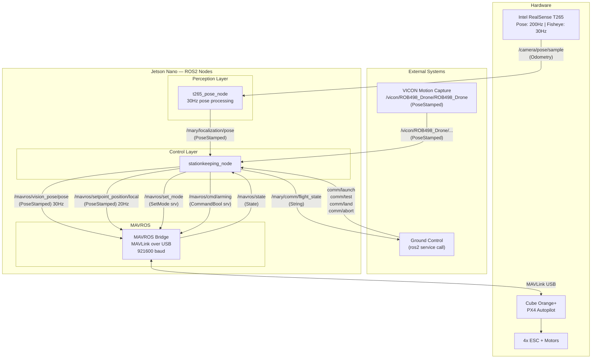
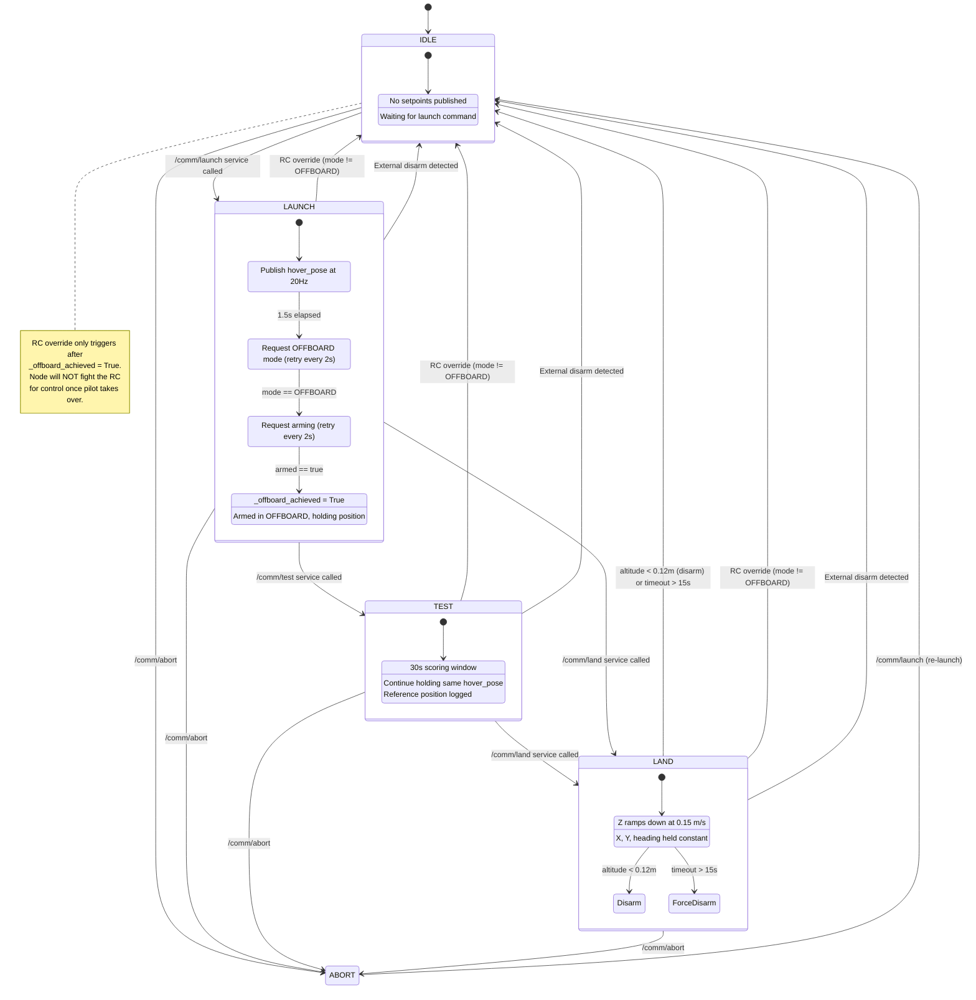
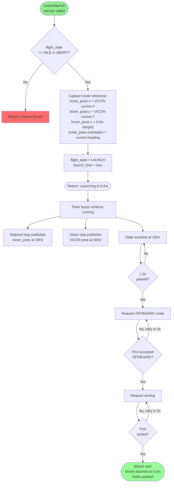
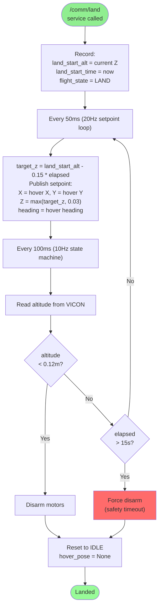
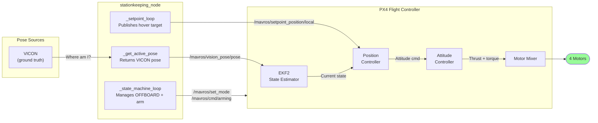

# Flight Test 2 Part I — Architecture & Algorithm Flowchart

## 1. System Architecture (Part I — VICON)

## 2. State Machine

## 3. Main Algorithm Flowchart

```mermaid
flowchart TD
    START(["Node Starts"]) --> INIT["Initialize:<br/>- flight_state = IDLE<br/>- hover_pose = None<br/>- Subscribe to VICON + T265 + MAVROS state<br/>- Create service servers<br/>- Start 3 timers"]

    INIT --> TIMERS

    subgraph TIMERS["Three Concurrent Timer Loops"]
        direction TB
        T1["Vision Pose Loop<br/>30Hz"]
        T2["Setpoint Loop<br/>20Hz"]
        T3["State Machine Loop<br/>10Hz"]
    end

    subgraph VP_LOOP["Vision Pose Loop (30Hz)"]
        VP1["Get VICON pose"] --> VP2{"VICON pose<br/>available?"}
        VP2 -->|Yes| VP3["Use VICON pose"]
        VP2 -->|No| VP4["Use T265 pose"]
        VP3 --> VP5["Publish to<br/>/mavros/vision_pose/pose"]
        VP4 --> VP5
        VP5 --> VP6(["PX4 knows where<br/>drone is"])
    end

    subgraph SP_LOOP["Setpoint Loop (20Hz)"]
        SP1{"flight_state?"} -->|IDLE / LAUNCH / TEST| SP2{"hover_pose<br/>set?"}
        SP2 -->|Yes| SP3["Publish hover_pose<br/>(fixed X, Y, Z=0.5m, heading)"]
        SP2 -->|No| SP4["Publish current pose<br/>(pre-launch stream)"]
        SP1 -->|LAND| SP5["Publish:<br/>X, Y, heading = hover_pose<br/>Z = start_alt - 0.15 * elapsed"]
        SP1 -->|ABORT| SP6["Stop publishing"]
        SP3 --> SP7["Publish to<br/>/mavros/setpoint_position/local"]
        SP4 --> SP7
        SP5 --> SP7
        SP7 --> SP8(["PX4 knows where<br/>to fly"])
    end

    subgraph SM_LOOP["State Machine Loop (10Hz)"]
        SM_RC{"_offboard_achieved<br/>AND flying state<br/>AND mode != OFFBOARD?"} -->|Yes| SM_RELEASE["RC override detected<br/>Reset to IDLE<br/>(stop fighting RC)"]
        SM_RC -->|No| SM_DISARM{"_offboard_achieved<br/>AND flying state<br/>AND not armed?"}
        SM_DISARM -->|Yes| SM_EXT_DISARM["External disarm detected<br/>Reset to IDLE"]
        SM_DISARM -->|No| SM1{"flight_state?"}
        SM1 -->|LAUNCH| SM_LAUNCH
        SM1 -->|LAND| SM_LAND
        SM1 -->|Other| SM_NOOP["No action"]

        subgraph SM_LAUNCH["_tick_launch"]
            L1{"elapsed<br/>< 1.5s?"} -->|Yes| L2["Wait<br/>(setpoints still streaming)"]
            L1 -->|No| L3{"mode ==<br/>OFFBOARD?"}
            L3 -->|No| L4["Request OFFBOARD<br/>(retry every 2s)"]
            L3 -->|Yes| L5{"armed?"}
            L5 -->|No| L6["Request arming<br/>(retry every 2s)"]
            L5 -->|Yes| L7["_offboard_achieved = True<br/>Log: Hovering,<br/>ready for TEST"]
        end

        subgraph SM_LAND["_tick_land"]
            D1["Read current altitude<br/>from VICON pose"] --> D2{"altitude<br/>< 0.12m?"}
            D2 -->|Yes| D3["Disarm<br/>Reset to IDLE"]
            D2 -->|No| D4{"elapsed<br/>> 15s?"}
            D4 -->|Yes| D5["Force disarm<br/>Reset to IDLE"]
            D4 -->|No| D6["Continue descending"]
        end
    end

    style START fill:#90EE90
    style VP6 fill:#87CEEB
    style SP8 fill:#87CEEB
    style L7 fill:#98FB98
    style D3 fill:#FFD700
    style D5 fill:#FF6B6B
    style SM_RELEASE fill:#FFD700
    style SM_EXT_DISARM fill:#FFD700
```

## 4. Launch Command Flowchart (What Happens When You Call /comm/launch)

## 5. Landing Flowchart

## 6. Data Flow Summary (Part I)

## Key Parameters (Part I)

| Parameter | Value | Purpose |
|-----------|-------|---------|
| `takeoff_altitude` | 0.5m | Exercise #2 hover height |
| `setpoint_rate` | 20Hz | Position commands to PX4 |
| `vision_pose_rate` | 30Hz | VICON pose relay to PX4 |
| `offboard_wait` | 1.5s | Setpoint stream before OFFBOARD request |
| `mode_request_interval` | 2.0s | Retry interval for OFFBOARD/arm |
| `descent_speed` | 0.15 m/s | Landing ramp rate |
| `land_disarm_altitude` | 0.12m | Disarm when below this |
| `land_timeout` | 15s | Force disarm safety net |
| `vicon_topic` | `/vicon/ROB498_Drone/ROB498_Drone` | VICON PoseStamped source |
