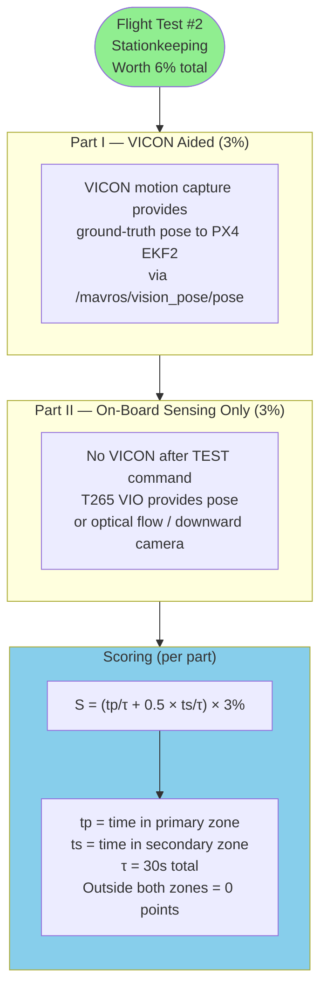
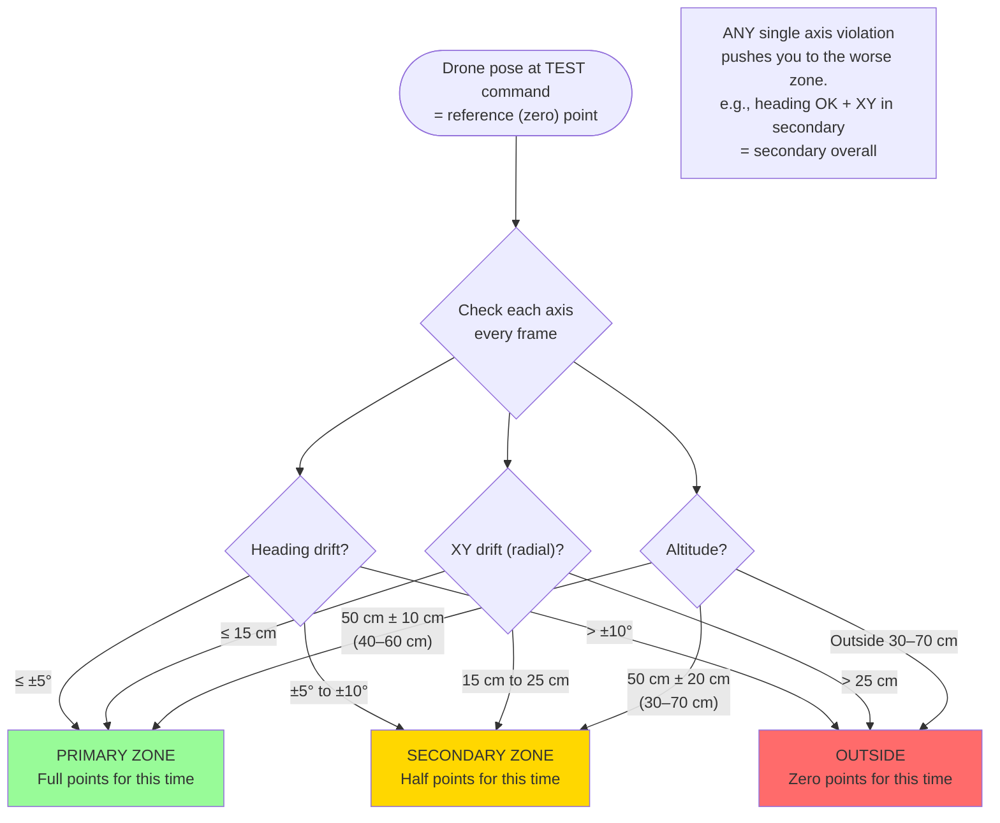
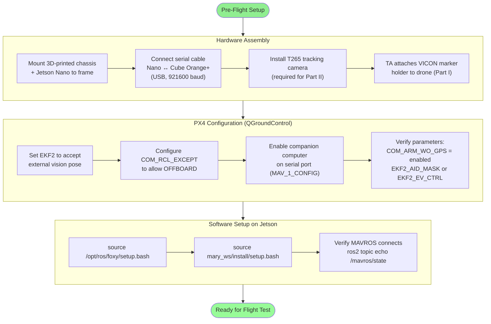
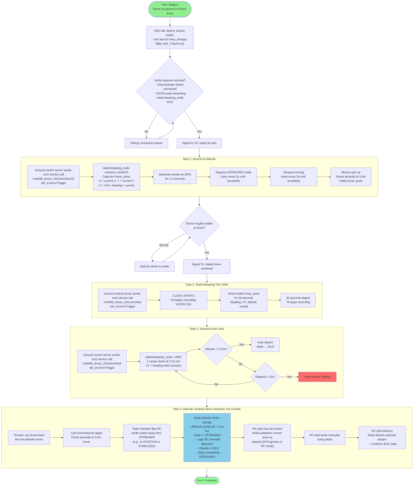
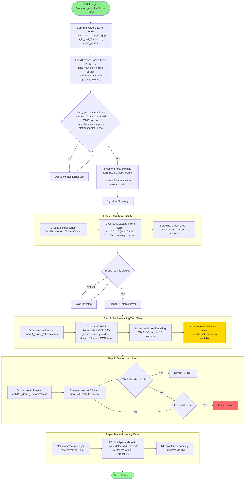
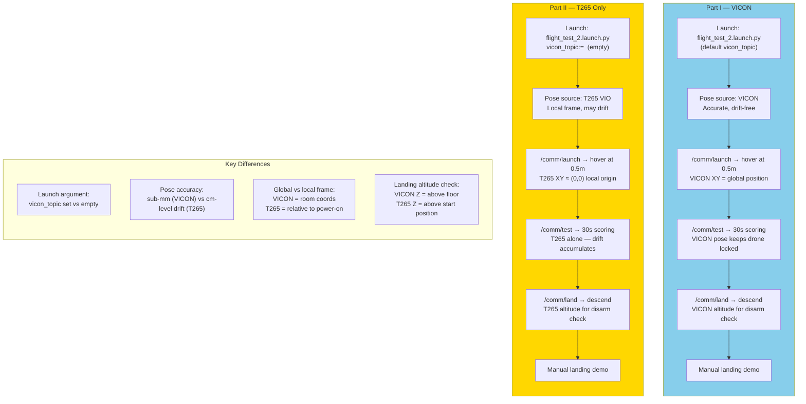
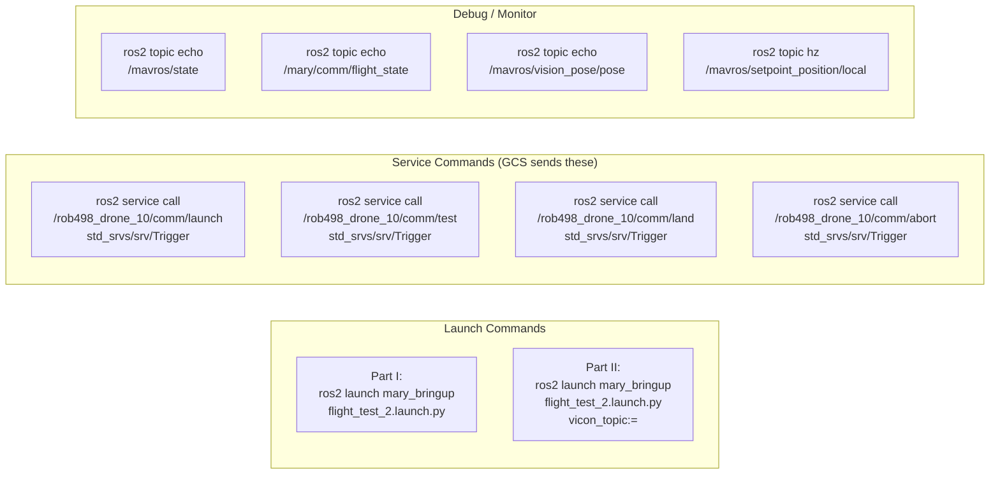

# Flight Test 2 — Full Procedure Flowcharts

## 1. Overall Test Structure

## 2. Scoring Zones

## 3. Pre-Flight Setup Procedure

## 4. Part I — Full Flight Procedure (VICON)

## 5. Part II — Full Flight Procedure (T265 Only)

## 6. Emergency Stops — ABORT and RC Override

```mermaid
flowchart TD
    subgraph SOFTWARE_ABORT["Option A: /comm/abort (software)"]
        A1(["Any state:<br/>IDLE, LAUNCH, TEST, LAND"]) --> A2
        A2["Ground control sends:<br/>/rob498_drone_10/comm/abort"] --> A3
        A3["Immediate motor disarm<br/>No descent ramp — just stops"] --> A4
        A4["Drone drops from current altitude<br/>(use only for safety emergencies)"] --> A5
        A5["State → ABORT<br/>Setpoints stop publishing<br/>_offboard_achieved reset"] --> A6
        A6["Can re-launch via<br/>/comm/launch"]
    end

    subgraph RC_OVERRIDE["Option B: RC Override (hardware)"]
        R1(["Drone flying in OFFBOARD<br/>(_offboard_achieved = True)"]) --> R2
        R2["RC pilot flips mode switch<br/>(e.g., to POSITION or STABILIZED)"] --> R3
        R3["PX4 exits OFFBOARD mode<br/>MAVROS reports new mode"] --> R4
        R4["stationkeeping_node detects:<br/>mode != OFFBOARD while<br/>_offboard_achieved = True"] --> R5
        R5["Node logs 'RC override detected'<br/>Resets to IDLE<br/>STOPS requesting OFFBOARD<br/>(does NOT fight the RC)"] --> R6
        R6["RC pilot has full manual control<br/>Lands using sticks, disarms"] --> R7
        R7["Node detects external disarm<br/>Confirms IDLE state<br/>Ready for re-launch"]
    end

    style A2 fill:#FF6B6B
    style A4 fill:#FF6B6B
    style R2 fill:#FFD700
    style R5 fill:#87CEEB
```

## 7. Complete Timeline — Part I vs Part II Side-by-Side

## 8. ROS2 Commands Reference

## Quick Reference — Test Parameters

| Parameter | Primary Zone | Secondary Zone |
|-----------|-------------|----------------|
| Heading | ±5° | ±10° |
| XY position (radial) | ≤ 15 cm | ≤ 25 cm |
| Altitude | 50 cm ± 10 cm | 50 cm ± 20 cm |
| Test duration | 30 seconds | 30 seconds |
| Scoring | `tp/τ × 3%` | `0.5 × ts/τ × 3%` |

| System Parameter | Value |
|-----------------|-------|
| Takeoff altitude | 0.5 m |
| Descent speed | 0.15 m/s |
| Disarm altitude | 0.12 m |
| Landing timeout | 15 s |
| Setpoint rate | 20 Hz |
| Vision pose rate | 30 Hz |
| OFFBOARD wait | 1.5 s |
| Max test sessions | 3 attempts |
